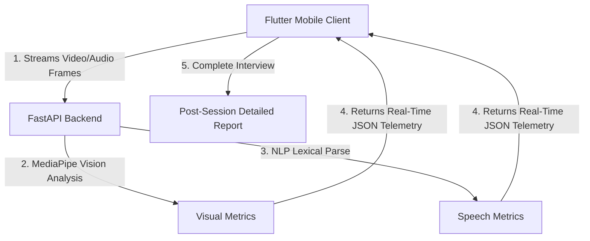

# AI-Powered Mock Interview Platform 🚀

An advanced, end-to-end mobile and backend solution designed to help candidates master their interview skills. By combining real-time computer vision analysis with natural language processing (NLP), the platform provides live behavioral diagnostics and detailed post-interview telemetry.

---

## 🌟 Core Features

### 1. Real-Time Vision Analytics (Google MediaPipe)
*   **Eye Contact Tracking**: Assesses camera gaze using head yaw/pitch angles to ensure active engagement.
*   **Skeletal Posture Diagnostics**: Uses body landmarks to measure shoulder tilt and alignment.
*   **Fallback Heuristics**: Automatically transitions to face mesh roll/pitch tracking when sitting close, giving accurate posture scores without shoulder visibility.
*   **Live Telemetry HUD**: A glassmorphic overlay card on the camera feed displaying real-time metrics dynamically.

### 2. Speech & Lexical Processing (NLP)
*   **Speaking Pace (WPM)**: Tracks verbal speed in Words Per Minute to promote clear delivery.
*   **Filler Word Counter**: Highlights verbal tics (e.g., *"um"*, *"uh"*, *"like"*, *"so"*) to help users speak more concisely.
*   **Technical Keyword Relevance**: Computes response relevance by matching transcripts against a job-role keyword database.

### 3. Voice Coach & Audio Streaming
*   **Asynchronous Audio Pipeline**: Streams recorded audio in 5-second chunks to the API for minimal latency.
*   **Interactive TTS Guide**: A Text-to-Speech system reads questions aloud.
*   **Device Lifecycle Optimization**: Built-in recovery timers prevent voice transition dropouts on custom Android overlays (like Xiaomi MIUI).

### 4. Interactive Performance Reports
*   **Aggregated Scoring**: Computes overall performance metrics based on visual presence, lexical structure, and speaking pace.
*   **History Logs**: Locally persists user profiles and past session data.

---

## 🏗️ Architecture



*   **Frontend**: Flutter (Dart)
*   **Backend**: FastAPI (Python)
*   **ML Engines**: Google MediaPipe (Face Mesh, Pose, Hands), Google Speech Recognition, Custom Lexical NLP

---

## 🚀 Getting Started

### Prerequisites
*   Flutter SDK (v3.0.0+)
*   Python 3.10+
*   Android SDK / ADB (for physical device testing)

---

### 1. Backend Setup (Python)

1. Navigate to the backend directory:
   ```bash
   cd backend
   ```
2. Create and activate a virtual environment:
   ```bash
   python -m venv .venv
   # On Windows:
   .venv\Scripts\activate
   # On macOS/Linux:
   source .venv/bin/activate
   ```
3. Install dependencies:
   ```bash
   pip install -r requirements.txt
   ```
4. Start the FastAPI Uvicorn server:
   ```bash
   python -m uvicorn app.main:app --host 0.0.0.0 --port 8000
   ```

---

### 2. Frontend Setup (Flutter)

1. Navigate to the frontend directory:
   ```bash
   cd frontend
   ```
2. Fetch package dependencies:
   ```bash
   flutter pub get
   ```
3. Enable reverse port forwarding (if testing on a physical Android device via USB):
   ```bash
   adb reverse tcp:8000 tcp:8000
   ```
4. Run the application:
   ```bash
   flutter run
   ```

---

## 🛠️ Technology Stack

| Component | Technology | Purpose |
| :--- | :--- | :--- |
| **Frontend** | Flutter / Dart | Interactive mobile UI, camera frames capture, audio recording |
| **Backend** | FastAPI / Uvicorn | High-performance asynchronous API endpoints |
| **AI / Vision** | MediaPipe | Real-time face mesh, pose tracking, gesture diagnostics |
| **NLP** | Python / SpeechRecognition | Vocal transcription, filler-word analysis, WPM scoring |
| **Storage** | SQLite / JSON | Profile configurations and session history |

---

## 📄 License
This project is licensed under the MIT License - see the LICENSE file for details.
